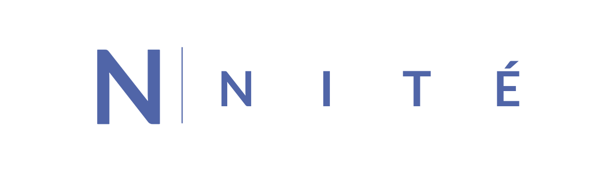

<!-- PROJECT LOGO -->

<br />
<div id="readme-top" style="text-align: center">
  <!--<a href="https://github.com/MysteriousPotato/nitecache" style="display: flex; justify-content: center;">
    
  </a>-->
    <h3>nitecache</h3>
    golang cache library
</div>


<!-- TABLE OF CONTENTS -->

# Table of Contents
- [Getting started](#getting-started)
- [Roadmap](#roadmap)
- [Contributing](#contributing)
- [License](#license)


<!-- ABOUT THE PROJECT -->

## About The Project

***disclaimer*** : This project is still experimental. Expect breaking changes. 

nitecache is an embedded and distributed cache library for golang that supports:
- sharding
- explicit cache eviction
- ttl
- lfu/lru eviction policies
- rpc for value updates
- type safety using generics

<!-- GETTING STARTED -->

## Getting started

### Installation

- requires go version >= 1.21

```sh
go get github.com/MysteriousPotato/nitecache@v0.4.3
```

### Usage

##### Creating a cache instance:

``` go
// Both ID and Addr must be unique across peers
self := {ID: "1", Addr: "node1:8100"},
members := []nitecache.Member{
    self, // You can omit self from the members list
    {ID: "2", Addr: "node2:8100"},
}

cache, err := nitecache.NewCache(self, members)
...
go func() {
    err := cache.ListenAndServe()
    ...
}


```

##### Creating a table:

``` go
// Specify the name of the table
table := nitecache.NewTable[string]("sessions").
    // If WithEvictionPolicy is omitted, nitecache won't apply any eviction policy
    WithStorage(nitecache.LRU(1024)).
    // Option to specify the cache-aside getter
    // If WithGetter is omitted, nitecache will return an error on cache miss. 
    WithGetter(func(ctx context.Context, key string) (Session, time.Duration, error) {
        sess, err := getSessionFromSomewhere()
        if err != nil {
            return Session{}, 0, err
        }
        //Return the value and a ttl (optional)
        return sess, time.Hour, nil
    }).
    Build(c) // Pass cache instance to Build method
```

##### Retrieving a value by key:

``` go
// If no corresponding value is found and no cache-aside getter was provided, returns ErrKeyNotFound.
value, err := table.Get(ctx, "key")
if err != nil {
}
```

##### Create a new entry:

``` go
if err := table.Put(ctx, "key", session, time.Hour); err != nil {
}
```

##### Evicting a value by key:

``` go
if err := table.Evict(ctx, "key"); err != nil {
}
```

##### Registering a RPC for value updates:

``` go
// WithProcedure is used to register the RPC.
table := nitecache.NewTable[RateLimitEntry]("rate-limiter").
    WithProcedure("incrementRL", func(r RateLimitEntry, params []byte) (RateLimitEntry, time.Duration, error) {
        r.Count++
        return r, 0, nil
    }).
    Build(c)
    
// You can pass parameters as bytes to the function call for more flexibility.
rlEntry, err = table.Call(ctx, "key", "incrementRL", []byte("Hello there!)])
if err != nil {
}
```

<!-- ROADMAP -->

## Roadmap

See the [open issues](https://github.com/MysteriousPotato/nitecache/issues) for a full list of proposed features (and known issues).

<!-- CONTRIBUTING -->

## Contributing

Contributions are what make the open source community such an amazing place to learn, inspire, and create. Any contributions you make are **greatly appreciated**.

If you have a suggestion that would make this better, please fork the repo and create a pull request. You can also simply open an issue with the tag "enhancement".


<!-- LICENSE -->

## License

Distributed under the MIT License. See [LICENSE](https://github.com/MysteriousPotato/nitecache/blob/main/LICENSE) for more information.